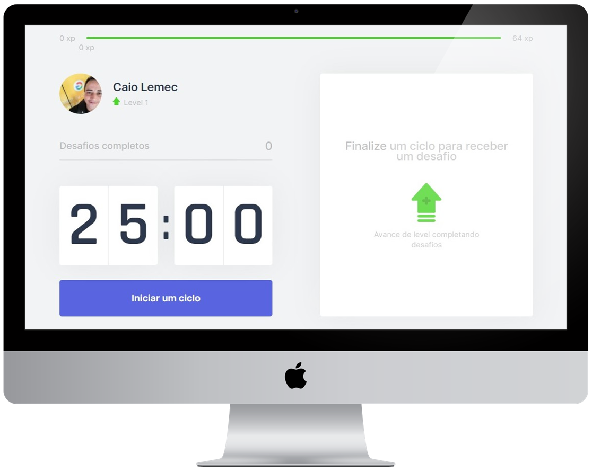

<h1 align="center">
    
</h1>

<p align="center">
  <a href="#-Project">Project</a>&nbsp;&nbsp;&nbsp;|&nbsp;&nbsp;&nbsp;
  <a href="#-Layout">Layoult</a>&nbsp;&nbsp;&nbsp;|&nbsp;&nbsp;&nbsp;
  <a href="#-Technology">Technology</a>&nbsp;&nbsp;&nbsp;|&nbsp;&nbsp;&nbsp;
  <a href="#-Environment">Environment</a>&nbsp;&nbsp;&nbsp;|&nbsp;&nbsp;&nbsp;
  <a href="#%EF%B8%8F-license">License</a>&nbsp;&nbsp;&nbsp;|&nbsp;&nbsp;&nbsp;
  <a href="#-Participants">Participants</a>
</p>
<br>

<p align="center">
  
</p>

<p align="center">
 
</p>

## 💻 Project

<strong>Move.it</strong> is a web application that helps people who spend long periods in front of the computer to minimize health impacts through small exercises.. 💪 

In this application it was possible to deepen knowledge in react hooks (state, effect, context). <br>
I learned theories like api flow, SPA, SSR, SSG, and more. <br>
I used <strong>React</strong> as library and <strong>Next.js</strong> as framework. 
Learned a lot of CSS and the importance of organizing styles with css-modules. <br>
I studied how to store data in cookies to save light progress. </br>


Web application created in [@Rocketseat's](https://github.com/Rocketseat) fourth edition of NextLevelWeek, an online event that occurred on February 22th to 26th, 2021.

<br>

## 🎨 Layout
<p align="center">
</p>

<h3 align="center">You can also check completed layout at <a href="https://www.figma.com/file/ge20pu3ofMOKoliUyKx1Nl/Move.it-1.0/duplicate">FIGMA</a>.</h3>

<br>

## 🔨 Technology

- [Node.js](https://nodejs.org/en/)
- [Next.js](https://nextjs.org/)
- [React](https://reactjs.org/)
- [Typescript](https://www.typescriptlang.org/)

<br>

## 📝 Environment

1. Clone the repository: 
```bash 
git@github.com:CaioLemec/move-it.git
```
2. Install node: 
```bash
 https://nodejs.org/en/
 ```
3. Open project folder in VSCode:
```bash
 cd ../move-it
 ```
4. Install dependencies by using command:
```bash
 npm install
 ```
5. At your terminal set this command line:
```bash
npm run dev
```
7. Access the generated address in your browser:
```bash
http://localhost:3000/
```

<br>

## ⚖️ License

<br>

This project is licensed under the MIT [LICENSE](LICENSE.md).

<br>

## 😃 Participants
<br>

<br>
<sub>&nbsp;&nbsp;&nbsp;Caio Lemec</sub>

<br>
<br>

[](caiolemec@gmail.com) [](https://br.linkedin.com/in/caio-lemec/) 


<hr>

<p align="center">⭐&nbsp;&nbsp;&nbsp;   Developed by Caio Lemec  &nbsp;&nbsp;&nbsp;⭐</p>
